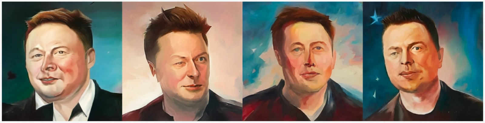
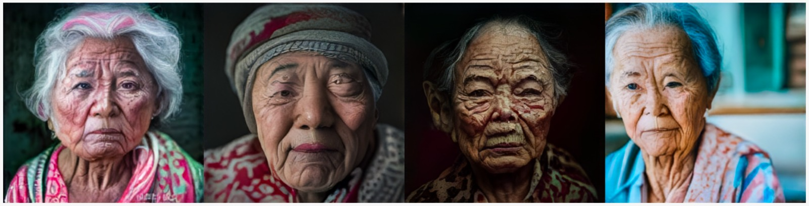
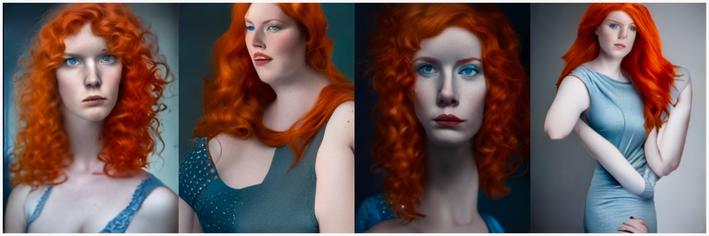

# Arroz Con Cosas
Literally translate as 'rice with things', this is how people from Valencia call anything that's not the "one and only Valencian Paella". Since this experimental is not quite/only Paella, but shares a lot of things with it, Arroz Con Cosas is a perfect fit.

## CLIP2Img v1

### Architecture

The base architecture used here is same used in [Paella](https://github.com/dome272/Paella/blob/main/modules.py) with very minor changes to the inputs/outputs to be able to repurpose it for denoising diffusion. 

The VQGAN is custom (and currently only trained on a very small dataset of 7K watercolor images) and uses a some tricks to increase codebook usage where removed from this code for simplicity, as well as using wavelets for an initial downsampling from 3x512x512 to 12x256x256. Even if the model was trained only on watercolor images, it shows great reconstruction capabilities in any type of picture, with some minor tendency to make watercolor textures.

### Training

TODO

## OpenCLIP H Prior v1

TODO

### License
The model code and weights are released under the [MIT license](https://github.com/dome272/Paella/blob/main/LICENSE).